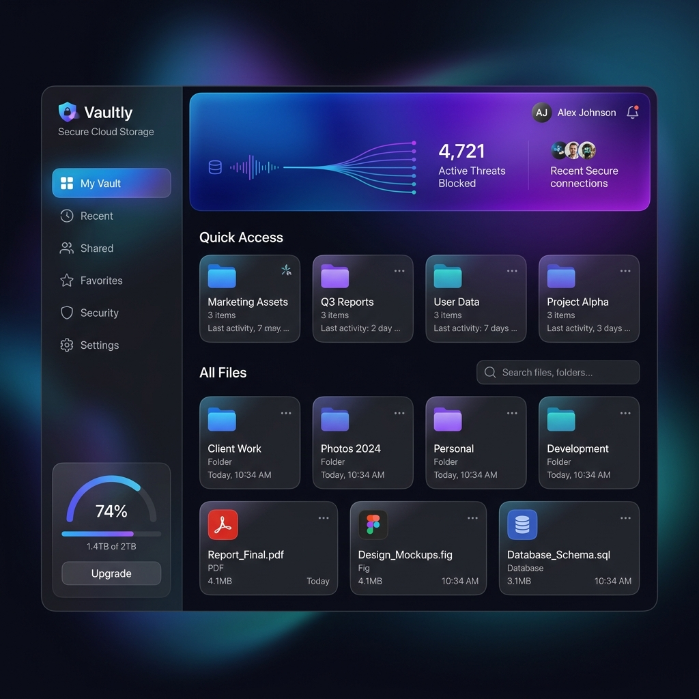

# CloudVault ☁️🔒



A modern, high-performance, and secure cloud storage platform. CloudVault enables users to effortlessly store, organize, and share their files and folders with real-time virus scanning and secure sharing capabilities.

## ✨ Features

- **Secure Storage**: Upload, manage, and download files with seamless local storage provisioning.
- **Folder Organization**: Create unlimited folder structures with support for zipping and downloading entire folder trees on-the-fly.
- **Secure File/Folder Sharing**: Share files and folders with other users seamlessly. Includes Transfer Requests and Accepted items views.
- **Security First**: Integrated with ClamAV to automatically scan all uploaded files for viruses and malware.
- **Modern Authentication**: Fully JWT-based authentication system for secure login and session management.
- **Stunning UI/UX**: Built with React, Vite, and custom CSS for a glassy, responsive, and beautiful experience.
- **Containerized Architecture**: Designed to be entirely deployed via Docker Compose (Frontend, Backend, DB, Proxy, ClamAV).

## 🚀 Getting Started

### Prerequisites

- [Docker](https://www.docker.com/) & [Docker Compose](https://docs.docker.com/compose/)

### Installation & Deployment

1. **Clone the repository:**
   ```bash
   git clone https://github.com/Vaibhavthepro/Cloud-Storage.git
   cd Cloud-Storage
   ```

2. **Configure environment variables:**
   Create a `.env` file in the root directory based on your setup. You will need variables for the PostgreSQL database, JWT secrets, etc.

3. **Spin up the containers:**
   CloudVault is fully containerized. Simply run the following command to build and start the entire stack:
   ```bash
   docker-compose up -d --build
   ```

4. **Access the application:**
   - **Frontend**: http://localhost
   - **Backend API**: http://localhost/api

## 🛠️ Technology Stack

**Frontend:**
- React (Vite)
- TypeScript
- Custom CSS (Glassmorphism design)
- Axios & React Router

**Backend:**
- Node.js & Express
- TypeScript
- Prisma ORM
- PostgreSQL
- ClamAV (Virus Scanning)
- Archiver (Zip streaming)
- JWT (Authentication)

## 🐳 Docker Services Overview

- `frontend`: The React UI served via an NGINX container.
- `backend`: The Express Node.js REST API.
- `db`: PostgreSQL database for all metadata and user accounts.
- `clamav`: Daemon for real-time virus/malware checking of file uploads.
- `proxy`: Main NGINX reverse proxy directing traffic to the frontend or backend appropriately.

## 📄 License

This project is open-source and available for use. 
